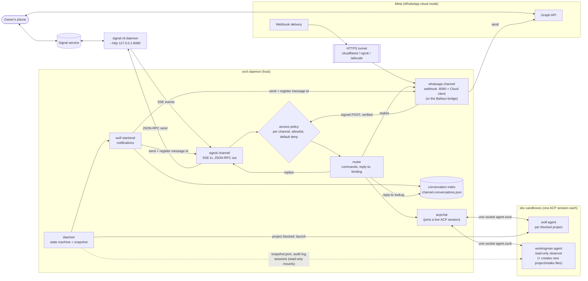

# Messaging channels (WhatsApp and Signal)

With a channel configured, the daemon talks to a human on their phone in both
directions:

- **Outbound** — a `🐺 wolf is running for <project>` message the moment a wolf
  agent has actually started, and a `🐺 wolf finished` message when it ends
  (see [wolf-notify.md](wolf-notify.md)).
- **Inbound** — everything the owner sends back is handed to the **router**
  (`internal/router`): a *reply* to a wolf message goes to that wolf, anything
  else goes to the always-on **workingman agent**, which answers questions about
  the orch state ([agents.md §8](../agents.md#8-workingman-agent)).

This mirrors hermes-agent's WhatsApp gateway (`gateway/platforms/whatsapp_cloud.py`,
`whatsapp_common.py`, `scripts/whatsapp-bridge/`) and Signal adapter
(`gateway/platforms/signal.py`); see the parity tables in the
[README](../README.md#channels--whatsapp) and
[below](#signal). Signal has its own page: [signal.md](signal.md).

Contents: [Architecture](#architecture) · [Quick start](#quick-start) ·
[Configuration reference](#configuration-reference) · [Signal](#signal) ·
[Routes and topics](#routes-and-topics) ·
[Routing rules](#routing-rules) · [Security model](#security-model) ·
[Tunnel setup](#exposing-the-webhook-tunnel-setup) · [Troubleshooting](#troubleshooting) ·
[Manual smoke test](#manual-smoke-test-real-meta-test-number) ·
[Signal smoke test](signal.md#manual-smoke-test)

## Architecture



Two things to keep in mind:

- The daemon never runs the agents' conversations itself. Each agent is a
  persistent ACP session (`acp-wrapper --persistent`) in its own sandbox; the
  router *attaches* to it (`acpchat.Attach`) over the session's unix socket,
  exactly as the TUI does, so the TUI, the daemon and the phone all share one
  conversation.
- Only messages that pass the channel's access policy reach the router. The
  router does no authorisation of its own.
- Channels are independent transports behind one registry: WhatsApp and Signal
  can run at the same time.

## Quick start

```sh
orch whatsapp setup        # credentials, owner allowlist, webhook; prints what to paste into Meta
orch whatsapp status       # masked config, Graph reachability, webhook listener
orch whatsapp test         # send a test message to the owner

# the workingman agent turns itself on when --acp-kit is set and an inbound channel exists
orch --root ~/orch --acp-kit <kit> --headless
```

`orch whatsapp setup` writes `~/.workingman/channels.yaml` (no secrets) and a
0600 `~/.workingman/secrets.yaml`. For a personal number via the Baileys bridge
use `orch whatsapp pair` instead ([whatsapp-bridge.md](whatsapp-bridge.md)).
For Signal use `orch signal setup` / `status` / `test` instead (no tunnel, no
console, no secrets file; it needs a running signal-cli daemon): see
[Signal](#signal) and [signal.md](signal.md).

Running with the TUI (no `--headless`) works the same way; the difference is who
starts a conversation in a new agent session: the TUI's watcher normally sends a
session's opening prompt. Headless, the router does it for the workingman agent
(it creates the ACP session and sends the standard "read
`.orch/instructions.md`…" opening prompt before the first question). A *wolf*
under `--headless` is not primed by anyone, so it launches but sits idle until a
TUI attaches; run the TUI (or `orch tui`) when you want wolves to work.

## Configuration reference

`orch --channels-config <file>` — default `~/.workingman/channels.yaml`, or
`$WORKINGMAN_CHANNELS_CONFIG`. A missing file (or one with every channel
`enabled: false`) disables channels and the daemon behaves exactly as before.
Unknown keys are errors, so a typo cannot silently weaken the config.

### Worked example (WhatsApp Cloud API)

```yaml
# ~/.workingman/channels.yaml
channels:
  whatsapp:                              # instance name (lowercase, [a-z0-9_-])
    type: whatsapp
    # enabled: false                     # keep the config but switch it off
    credentials:                         # references only — never inline values
      access_token: {file: ~/.workingman/secrets.yaml, key: whatsapp_access_token}
      app_secret:   {file: ~/.workingman/secrets.yaml, key: whatsapp_app_secret}
      verify_token: {file: ~/.workingman/secrets.yaml, key: whatsapp_verify_token}
      # or from the environment:  {env: WHATSAPP_ACCESS_TOKEN}
    options:
      mode: cloud                        # cloud (default) | bridge
      phone_number_id: "109876543210987" # Meta's id for the sending number (not the phone number)
      # waba_id: "123456789"             # also bind the webhook to your business account
      # api_version: v20.0
      # graph_base_url: https://graph.facebook.com
      webhook_host: 127.0.0.1            # loopback by default; front it with a tunnel
      webhook_port: 8090
      webhook_path: /whatsapp/webhook
      # insecure_skip_signature: true    # DANGEROUS: accept unsigned POSTs (only without an app secret)
      access:                            # who may talk to the daemon; empty = nobody
        allow_from: ["+1 555 123 4567"]  # the owner
        # deny_reply: "Sorry, I can't chat with you."   # off by default: strangers get silence
        # deny_reply_interval: 1h

routes:                                  # where the daemon's own messages go
  - {topic: wolf,       channel: whatsapp, chat: "15551234567"}
  - {topic: workingman, channel: whatsapp, chat: "15551234567"}
  # - {topic: "*",      channel: whatsapp, chat: "15551234567"}   # everything else

notify:
  wolf_start_interval: 10m               # at most one wolf-start message per project per interval (0s = no limit)

router:                                  # inbound router (all optional)
  permission_timeout: 2m                 # unanswered agent permission requests are rejected after this
  turn_timeout: 5m                       # a turn is cancelled after this long
  thinking_after: 10s                    # "…thinking" ack for turns longer than this
  queue_size: 5                          # messages queued per chat behind the running turn
```

```yaml
# ~/.workingman/secrets.yaml   (chmod 600 — the daemon refuses anything looser)
whatsapp_access_token: EAAG...
whatsapp_app_secret: 0123456789abcdef0123456789abcdef
whatsapp_verify_token: a-long-random-string
```

### Keys

| Key | Meaning |
|---|---|
| `channels.<name>.type` | selects the factory: `whatsapp` or `signal` |
| `channels.<name>.enabled` | default `true` |
| `channels.<name>.credentials.<cred>` | `{env: NAME}` or `{file: PATH, key: KEY}`; a file must be mode 0600. WhatsApp cloud credentials: `access_token` (required), `app_secret` (required for the webhook), `verify_token` (the subscription handshake) |
| `…options.mode` | `cloud` (default) or `bridge` |
| `…options.phone_number_id`, `waba_id`, `api_version`, `graph_base_url` | Cloud API identity and endpoint |
| `…options.webhook_host` / `webhook_port` / `webhook_path` | where the webhook listens (default `127.0.0.1:8090/whatsapp/webhook`; `/health` is reserved) |
| `…options.insecure_skip_signature` | accept unsigned POSTs; only honoured when no app secret is set |
| `…options.access.mode` | `bot` (default, a number of its own) or `self-chat` (bridge only) |
| `…options.access.allow_from` | admitted senders (phone numbers or LIDs); `*` is rejected |
| `…options.access.allow_all` | **dangerous** opt-in: admit everyone, logs a loud warning |
| `…options.access.groups`, `group_allow_from`, `require_mention`, `mention_patterns`, `free_response_chats` | group chats (bridge only; the Cloud API serves direct chats) |
| `…options.access.deny_reply`, `deny_reply_interval` | optional reply to a denied sender, rate-limited per sender |
| `…options.access.self_ids`, `reply_prefix`, `forward_owner_messages` | self-chat / owner-message handling (bridge) |
| `…options.bridge.*` | Baileys bridge supervision: see [whatsapp-bridge.md](whatsapp-bridge.md) |
| Signal: `…options.http_url`, `account`, `plain_text`, `access.allow_from` / `note_to_self` / `groups` / `group_allow_from` / `allow_all`; `credentials.account` | see [signal.md](signal.md#configuration) |
| `routes[]` | `{topic, channel, chat}`; see below |
| `notify.wolf_start_interval` | rate limit for wolf-start messages |
| `router.*` | inbound router timeouts and queue |

Daemon flags that matter here: `--channels-config`, `--workingman-agent[=auto|on|off]`,
`--acp-kit`, `--sessions-root`, `--state-file`, `--wolf-host`,
`--wolf-unblock-grace`, `--wolf-idle-timeout`, `--headless` (`orch --help`).

## Signal

Signal is a second transport behind the same registry, routes and router, so
everything above (wolf-start messages, quote-replies routed through the
conversation index, the allowlist) works the same. It talks to a
[signal-cli](https://github.com/AsamK/signal-cli) daemon (`signal-cli -a
+15551234567 daemon --http 127.0.0.1:8080`): inbound over its SSE stream,
outbound as JSON-RPC. Compared with WhatsApp cloud there is **no Meta console,
no webhook, no tunnel and no 24-hour window**. The full guide, including the
step-by-step "bind the workingman agent and the wolf to Signal", is
[signal.md](signal.md); the short version:

```sh
orch signal setup    # signal-cli URL, account, owner allowlist, optional groups; writes the signal section and routes
orch signal status   # masked config + signal-cli reachable / account registered   (--offline skips the check)
orch signal test [--to <number|uuid|group:ID>] [message]
```

`setup` is interactive, or driven by flags (`--http-url`, `--account`,
`--allow-from`, `--note-to-self`, `--groups`, `--group-allow-from`,
`--route-topics`, `--no-routes`) / `SIGNAL_HTTP_URL`, `SIGNAL_ACCOUNT`,
`SIGNAL_ALLOW_FROM` with `--non-interactive`. It is idempotent, preserves the rest
of `channels.yaml`, adds `wolf` and `workingman` routes to the first owner, and
refuses to save when signal-cli is unreachable or the account is not registered
unless `--skip-validate` is given.

### Worked example (Signal)

```yaml
# ~/.workingman/channels.yaml
channels:
  signal:
    type: signal
    options:
      http_url: http://127.0.0.1:8080      # default
      account: "+15551234567"              # the number signal-cli is registered or linked as
      access:
        allow_from: ["+15557654321"]       # the owner; E.164 numbers or UUIDs; empty = nobody
        # note_to_self: true               # admit the account's own "Note to Self" chat
        # groups: true
        # group_allow_from: ["<group id>"] # groups need an explicit list

routes:
  - {topic: wolf,       channel: signal, chat: "+15557654321"}
  - {topic: workingman, channel: signal, chat: "+15557654321"}
```

No credentials are required; the account number may instead be given as
`credentials: {account: {env: SIGNAL_ACCOUNT}}`.

### Signal alongside WhatsApp

Define both channels (different instance names) in the same file. A topic routed
to both is sent on both; a reply is answered on the channel the question arrived
on; each chat keeps its own `/wolf` / `/agent` binding. Give the same topic one
route per channel:

```yaml
routes:
  - {topic: wolf, channel: whatsapp, chat: "15551234567"}
  - {topic: wolf, channel: signal,   chat: "+15557654321"}
```

### Reply-to routing on Signal

Signal's *Reply* sends a quote whose id is the quoted message's timestamp. The
channel returns that timestamp as the id of every message it sends, so the
conversation index maps a swipe-reply to a `🐺 wolf is running…` message back to
that wolf, exactly as WhatsApp's `context.message_id` does. Outbound, the first
chunk of a reply quotes the message it answers in direct chats (not in groups).

## Routes and topics

A *topic* is a free-form tag on an outbound message. A route says "messages with
this topic go to this chat on this channel":

- `wolf` — the daemon's wolf-start / wolf-end messages, and every relayed wolf
  answer (shown as `[wolf <work-stream>]`).
- `workingman` — reserved for the workingman agent's own messages. Replies to a
  question go back to the chat that asked it, so a route is optional.
- `*` — wildcard: receives a message only when its topic has **no** exact route.
  Plain notifications (e.g. "Project blocked", sent alongside the macOS pop-up)
  have no topic and so reach only wildcard routes.

A topic may have several routes; each receives the message, concurrently, and one
channel failing never holds up the others. A topic with no route is not an error:
nothing is sent. The topic is shown as a `[topic] ` prefix, since neither
WhatsApp nor Signal has threads. A `chat` is a phone number for WhatsApp, and for
Signal an E.164 number, a UUID or `group:<groupId>`.

## Routing rules

A message is handled by the first rule that applies.

1. **Commands.** A message that starts with `/command` is answered by the
   router itself — no LLM, and never queued behind a running turn:

   | Command | Effect |
   |---|---|
   | `/help` | list the commands |
   | `/status` | one-line summary from the daemon snapshot: projects by status, live sessions by kind, task counts |
   | `/wolf [work-stream]` | bind this chat to a live wolf: the named project's (exact name, else a unique substring), or the only one. `no wolf running` when there is none; several wolves and no name lists them |
   | `/agent` | bind the chat back to the workingman agent |
   | `/who` | show what the chat is bound to |

   Paths such as `/etc/hosts` are not commands; they are ordinary text.

2. **A pending permission request.** If an agent asked this chat for
   permission (rule 5), the message is the answer.

3. **A reply to a wolf notification.** When the message is a reply-to
   (`InboundMessage.ReplyToID`) of a message in the conversation index — the
   "🐺 wolf is running for …" start message, or an answer the router relayed
   from a wolf — the text goes to **that wolf session** as a prompt and the
   wolf's answer comes back labelled `[wolf <work-stream>]`. A reply does not
   change the chat's binding. If the wolf has ended, or the notification was
   from an earlier session of the same project, the router says so instead of
   guessing.

4. **The chat's binding.** By default the chat is bound to the **workingman
   agent**: the text is sent to it with `Ask` and its reply is sent back. After
   `/wolf` the chat is bound to a wolf and its messages go there (replies are
   labelled `[wolf <work-stream>]`) until `/agent` — or until the wolf session
   ends, at which point the chat falls back to the workingman agent and is told
   so. The message that discovered the ended wolf is *not* forwarded to a
   different agent; resend it.

## Observe mode and permissions (chat bound to a wolf)

- Anything the wolf says while someone **else** drives it (the TUI user typing
  into the same ACP session) is relayed to every chat bound to it, labelled
  `[wolf <work-stream>]`. The router's own turns are not repeated.
- The wolf's tool-permission requests are put to the chat:

  ```
  [wolf alpha] 🔐 Permission needed: Run `git push`
  1) Allow once
  2) Always allow
  3) Reject
  Reply yes or no (or an option number). I'll reject it if there's no answer in 2m.
  ```

  The chat's next message answers it: `yes`/`ok`/`allow` (allow once),
  `always`, `no`/`deny`/`stop` (reject), an option number, or an option's own
  name. Anything else is not consumed as an answer; the router asks again. An
  unanswered request is **rejected** after `router.permission_timeout`
  (default 2m), and a request with no chat to ask — nobody is bound to the wolf
  and no turn of the router's is in flight — is rejected at once. A permission
  request raised while the router's own turn is waiting for the agent is asked
  of that chat, and the answer bypasses the queue.

## Robustness

- **One turn at a time per chat**, through a bounded queue
  (`router.queue_size`, default 5). A message that arrives while a turn runs is
  acknowledged ("The agent is busy with your previous message; yours is queued
  (#1)"); past the bound it is dropped with a message. Turns for the same
  agent from different chats are serialised too.
- **Slow turns.** The typing indicator is shown (channels with one, refreshed
  every 20s), and a turn still running after `router.thinking_after` (default
  10s) gets a single "…thinking" message.
- **Turn timeout** — `router.turn_timeout` (default 5m): the agent is asked to
  cancel and the chat gets a friendly message with whatever text had arrived.
- **Agent down.** While the daemon has no live workingman agent (starting, or
  being relaunched after a crash) the reply is immediate: *"The workingman agent
  is starting up, try again in a minute."* The same reply is used when the
  session is listed but cannot be attached to yet. Nothing hangs.
- **Long replies** are cut at 12000 characters, and split by the channel's own
  chunking: WhatsApp splits under 4096 characters inside `Send`; a channel
  implementing `channels.Chunker` is split by the router instead.
- **No secrets echoed.** Every reply, permission prompt and error passes
  through `audit.Redact` (the same helper the state snapshot uses): tokens, API
  keys, passwords, bearer headers, URL credentials and private-key blocks
  become `[REDACTED]`. Only the agent's final text segment is sent, not its
  tool-call narration.

## Router wiring

The `router:` block of `channels.yaml` (see the configuration reference) is
optional.

The router is created when the daemon starts its channels
(`daemonChannels.start` in `cmd/orch/channels.go`), after the wolf-start wiring,
and is closed with them. It reaches the daemon through `router.Source`
(`WorkingmanAgentSession`, `WolfSessions`, `StatusSummary`) and the ACP
sessions through `acpchat.Attach`.

## Audit events

`router_inbound`, `router_command`, `router_route`, `router_queued`,
`router_queue_full`, `router_turn_done`, `router_turn_error`,
`router_agent_down`, `router_attached`, `router_bind`, `router_binding_ended`,
`router_observe_relay`, `router_permission_asked`,
`router_permission_answered`, `router_permission_timeout`,
`router_permission_rejected`, `router_reply_unroutable`, `router_send_error`,
`router_index_error`, `router_attach_error`, `router_primed`,
`router_prime_error`.

Each line identifies the chat as `<channel>:<first 8 hex digits of the SHA-256
of the chat id>` and carries message *lengths*, never the message text or the
raw chat id.

## Security model

This channel lets a phone drive an agent that can read your orch state, so every
default is fail-closed.

- **Allowlist, default deny.** A zero-value config, an empty `allow_from`, a
  missing self id or an unknown chat type all deny. `*` is rejected in
  `allow_from`; the only way to admit everyone is the explicit, loudly-logged
  `allow_all: true`. A denied sender gets no reply (unless `deny_reply` is set),
  and denials are logged with the reason and a masked id, never the message
  text. Ids are normalised (`+1 (555) 123-4567`, `15551234567@s.whatsapp.net`,
  LIDs) the way hermes-agent does, so formatting cannot bypass the list.
- **Authenticated webhook.** Every POST must carry a valid `X-Hub-Signature-256`
  (HMAC-SHA256 of the raw body keyed by the app secret, constant-time compare);
  otherwise `401`. The webhook refuses to start without an app secret unless
  `insecure_skip_signature` is set. Bodies are capped at 3 MiB, messages are
  de-duplicated by `wamid`, and the subscription handshake compares the verify
  token in constant time. The listener binds loopback by default and warns when
  bound elsewhere.
- **Read-only agent sandbox.** The workingman agent runs in its own sbx sandbox
  whose writable mounts are a scratch directory and the orch roots (the
  prompt limits it to creating new `project.md` / `intake/*.md` files); the
  state-snapshot directory, the audit-log directory and the ACP sessions root
  are mounted `:ro` (the mount enforces it — the prompt does not). It has no
  GitHub or other secrets and no extra network policy, and it is told not to change
  `.project.yaml` or `tasks/` (the roots are writable, so the prompt is the guard there); to act it names the TUI command or YAML edit for
  the human. The wolf is sandboxed too and can only write its project's control
  directory (+ its worktree). The workingman agent is told its replies go out
  over a phone messenger (short, plain text, no secrets).
- **Tool permissions are asked, not assumed.** When a wolf raises a permission
  request, the router puts it to the bound chat; no answer within
  `router.permission_timeout` (or nobody to ask) is a **rejection**.
- **Secrets handling.** Credentials are references (`env` / `0600` secrets file);
  inline values are a config error. They are held in a `channels.Secret` that
  prints as `[REDACTED]` through `fmt`, JSON and `slog`; the Cloud client scrubs
  the token from errors. Everything the router sends back, and every audit line,
  passes through `audit.Redact` (tokens, API keys, passwords, bearer headers,
  URL credentials, private-key blocks). Router audit lines identify a chat by a
  short hash and carry message *lengths*, not text. Keep the secrets file
  **outside** the directories mounted into the workingman agent (the default
  `~/.workingman/secrets.yaml` is), and note that `channels.log` lives beside the
  audit log, which that agent can read.
- **24-hour window (WhatsApp only).** Meta only lets a business message a user who wrote in the
  last 24 hours (templates excepted; the daemon sends none). A wolf-start message
  to a chat that has been silent for a day fails with a typed error
  (`channel_send_error` in the audit log) rather than being dropped silently.

## Exposing the webhook (tunnel setup)

Meta calls a **public https** URL; the listener is loopback-only. Put a tunnel
in front of it:

```sh
# any one of:
cloudflared tunnel --url http://127.0.0.1:8090
ngrok http 8090
tailscale funnel 8090
```

Then, in the Meta developer console (App Dashboard → WhatsApp → Configuration →
Webhook):

1. Callback URL: `https://<tunnel-host>/whatsapp/webhook` (`orch whatsapp setup
   --public-url https://<tunnel-host>` prints it exactly).
2. Verify token: the value in `secrets.yaml` (`orch whatsapp setup` prints it).
3. Subscribe to the **messages** field.
4. While the app is in development, add the owner's number to the recipient list
   (WhatsApp → API Setup).

Check the loop locally with the daemon running:

```sh
curl -s http://127.0.0.1:8090/health                     # status, counters, which secrets are set
curl -s "https://<tunnel-host>/whatsapp/webhook?hub.mode=subscribe&hub.verify_token=<token>&hub.challenge=42"   # → 42
```

Free tunnels change their URL on restart; re-register the callback when it does.

## Troubleshooting

| Symptom | Likely cause / fix |
|---|---|
| Daemon starts but no channel is mentioned in the audit log | no/`enabled: false` config: look for `channels_disabled`; `--channels-config` path wrong |
| `channels: …` startup error | invalid config (unknown key, inline secret, bad route); the message names the key. `secrets file … must not be accessible by group/others` → `chmod 600` |
| `channel_start_error`: webhook refuses to start | no `app_secret`; set it, or (only for local testing) `insecure_skip_signature: true` |
| Meta's "verify" button fails | tunnel not forwarding to the webhook port; wrong verify token (`403`); path mismatch with `webhook_path`; check `/health` locally |
| Messages sent from the phone get no reply | sender not in `allow_from` (audit/`channels.log`: `sender_not_allowlisted`); webhook not subscribed to `messages`; signature failures (`rejected_signature` in `/health` — wrong app secret); app still in development and the sender isn't a recipient |
| Wolf started but no WhatsApp message | outside the 24-hour window (`channel_send_error`, 131047): message the number once, then retry; no `wolf` (or `*`) route; rate-limited (`wolf_start_suppressed`); the start message is sent only once the session really started |
| Replying to the wolf message says the wolf ended / is from an earlier session | the wolf session ended or was relaunched; reply to the newer message, or `/wolf` |
| "The workingman agent is starting up, try again in a minute." | agent not running yet or being relaunched (it restarts with 5s→5m backoff): check `workingman_agent_*` audit events; it needs `--acp-kit` and `--workingman-agent` (auto-on only with an inbound channel) |
| `/wolf` says the wolf cannot be attached | the wolf runs on the host under tmux (`--wolf-host`); only ACP wolves can be tuned into |
| Wolf never starts working under `--headless` | nobody sends a wolf its opening prompt headless; run the TUI |
| Reply says "I cancelled it" | the turn exceeded `router.turn_timeout` |
| Signal: `orch signal status` / `test` fails, or no messages arrive | signal-cli daemon not running, `http_url` mismatch, account not registered, sender not on `allow_from`: see [signal.md troubleshooting](signal.md#troubleshooting) |
| A bridge-mode channel stopped after "logged out" | WhatsApp unlinked the device (exit 78); run `orch whatsapp pair --reset` |

Signal has no tunnel, webhook or 24-hour window to go wrong; its failures are
signal-cli being down or unregistered and the allowlist.

Logs: the audit log (`router_*`, `wolf_*`, `channel_*` events), `channels.log`
beside it (webhook and send details, ids masked), `whatsapp-bridge.log` for the
bridge backend. `orch whatsapp status` is the quickest health check.

## Limits

The router attaches to sessions that already exist (`acpchat.Attach` adopts the
ACP session id recorded in the session's `stream.log`); the one exception is the
workingman agent, whose session the router creates (and primes) when nobody else
has. A wolf running on the host under tmux (`--wolf-host`) has no ACP session, so
`/wolf` reports that it cannot be attached. The wire behaviour of the real
`claude-acp-client` when it receives a prompt for a session this connection did
not create is the one thing that needs a live smoke test (see the `acpchat`
package comment, and steps 6 and 12 above).

## Manual smoke test (real Meta test number)

For Signal see [signal.md](signal.md#manual-smoke-test).

The automated end-to-end test (`cmd/orch/channels_e2e_test.go`) runs the whole
pipeline against fakes. What it cannot prove — Meta's real delivery, signatures
and the real ACP agents — needs this checklist, once, with a Meta **test number**
(WhatsApp → API Setup gives a free one) and a throwaway project.

Prerequisites: `acp-wrapper`, the sbx CLI and an `--acp-kit`; a Meta app with a
test number; a tunnel tool; your own phone added as a recipient.

1. [ ] `orch whatsapp setup --public-url https://<tunnel-host>` with the test
   number's phone-number id, access token, app secret and your phone as owner;
   the Graph check passes.
2. [ ] `chmod`/`ls -l ~/.workingman/secrets.yaml` is `-rw-------`; `channels.yaml`
   contains no token.
3. [ ] Start the tunnel, then the daemon *with* the TUI (wolves are primed by
   it): `orch --root <dir> --acp-kit <kit>`. `orch whatsapp status` shows Graph
   reachable and the webhook listening; `curl http://127.0.0.1:8090/health`
   answers.
4. [ ] In the Meta console, register the callback URL + verify token: it turns
   green; subscribe to **messages**.
5. [ ] `orch whatsapp test` → the test message arrives on your phone.
6. [ ] Message the number from your phone: *"hi"*. A workingman-agent answer
   arrives (first one may take a minute while the sandbox boots; before then you
   get *"starting up, try again"*).
7. [ ] Ask *"which projects are open?"* → an answer that matches `orch status`.
   (Optionally restart with `--headless` and repeat 6–7: the router creates and
   primes the workingman agent's session itself.)
8. [ ] `/help`, `/status`, `/who` answer instantly, without the agent.
9. [ ] From a **different** phone (or edit `allow_from` temporarily) send a
   message → no reply, and `channels.log` shows `sender_not_allowlisted`.
10. [ ] POST a forged body to the public URL without a signature
   (`curl -X POST https://<tunnel-host>/whatsapp/webhook -d '{}'`) → `401`;
   `/health` `rejected_signature` goes up.
11. [ ] Create a project and make it blocked (`status: blocked` with a
   `blocked_reason`). Within seconds exactly **one** `[wolf] 🐺 wolf is running
   for <project>` message arrives. Touch the project file again: no second one
   (rate limit).
12. [ ] **Reply** to that message (long-press → Reply): the answer comes back as
   `[wolf <project>] …`, and the wolf's tab in the TUI shows your text.
13. [ ] Send a plain message (not a reply): it goes to the workingman agent,
   not the wolf. `/wolf` binds the chat to the wolf; `/agent` unbinds.
14. [ ] If the wolf asks for a tool permission, the `🔐 Permission needed` prompt
   arrives; `no` rejects it, silence rejects after `permission_timeout`.
15. [ ] Resolve the block (set the project to `ready`): after the unblock grace
   a `🐺 wolf finished for <project>` message arrives.
16. [ ] Stop the daemon (Ctrl-C): it exits promptly, the webhook port is free,
   `/health` no longer answers; the workingman agent's sandbox stops and the next
   start launches a fresh one.
17. [ ] Wait out the 24-hour window (or use a number that hasn't written for a
   day) and trigger a wolf: the audit log shows `channel_send_error` mentioning
   the 24-hour window, and the daemon carries on.
18. [ ] Grep `~/.workingman/**/*.log`, the audit log and your phone's messages
   for the access token and app secret: no hits.
