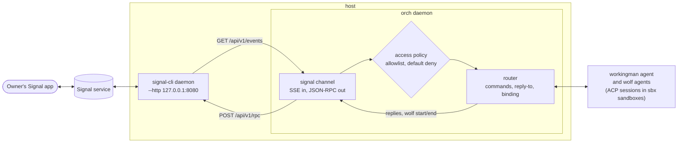

# Signal channel

The `signal` channel puts the same two-way conversation as the
[WhatsApp channel](channels.md) on Signal: the daemon messages the owner when a
wolf starts or ends, a *reply* to a wolf message goes to that wolf, and anything
else goes to the always-on **workingman agent**. Routing, topics, commands
(`/help /status /wolf /agent /who`), permission prompts, the router's timeouts
and the audit log are the channel-independent machinery described in
[channels.md](channels.md); this page covers what is specific to Signal and how
to bind agents to it.

It mirrors hermes-agent's Signal adapter (`gateway/platforms/signal.py`,
documented in `website/docs/user-guide/messaging/signal.md`): a
[signal-cli](https://github.com/AsamK/signal-cli) daemon in HTTP mode, inbound
messages over its SSE stream, outbound messages as JSON-RPC calls.

Contents: [How it works](#how-it-works) · [Differences from WhatsApp](#differences-from-whatsapp) ·
[Bind an agent to a Signal channel](#bind-a-workingman-agent-and-the-wolf-to-a-signal-channel) ·
[Configuration](#configuration) · [Access control](#access-control) ·
[Behaviour](#behaviour) · [Security](#security) · [Troubleshooting](#troubleshooting) ·
[Manual smoke test](#manual-smoke-test)

## How it works



- `signal-cli` is the only thing that speaks the Signal protocol. It holds the
  account's keys and runs as a long-lived process next to the orch daemon.
- The channel connects to `GET <http_url>/api/v1/events?account=<account>` and
  reads messages as they arrive. If signal-cli is down the channel logs it and
  retries with jittered exponential backoff (2s up to 60s); starting orch before
  signal-cli is fine.
- Sending is `POST <http_url>/api/v1/rpc` (`send`, `sendTyping`; `orch signal
  status` also calls `version` and `listAccounts`).
- Messages that pass the access policy go to the router; nothing else reaches an
  agent.

## Differences from WhatsApp

| | WhatsApp (cloud) | Signal |
|---|---|---|
| Transport | Meta Cloud API: signed webhook in, Graph API out | signal-cli daemon on the host: SSE in, JSON-RPC out |
| Public URL / tunnel | required (cloudflared, ngrok, tailscale) | **none**; everything is on loopback |
| Meta console, app, webhook registration, verify token | required | **none** |
| Secrets in `secrets.yaml` | access token, app secret, verify token | **none** by default (the account number may be a credential reference, `credentials.account`) |
| 24-hour customer-service window | yes: a wolf-start message to a chat silent for a day fails | **no window**: a wolf-start message can be sent at any time |
| Number | a Meta test or business number | a Signal number registered or *linked* in signal-cli (your own, as a linked device, or a dedicated one) |
| Message to oneself | not delivered by the API | **Note to Self** works (`note_to_self: true`) |
| Group chats | not supported | opt-in, per group (`groups`, `group_allow_from`) |
| Message length | split at 4096 characters | split at 8000 characters |
| Formatting | WhatsApp markup | Markdown becomes native Signal text styles (`plain_text: true` turns it off) |
| Quoted reply | `context.message_id` | `quoteTimestamp`/`quoteAuthor` (direct chats only) |
| Fixed cost | none | signal-cli process (needs a Java runtime) kept running |

The access model is the same: default-deny allowlist, no wildcard, an explicit
and loudly-logged `allow_all`.

## Bind a workingman agent (and the wolf) to a Signal channel

"Binding" an agent to Signal means two things in
`~/.workingman/channels.yaml`: the `signal` channel exists with an owner on its
allowlist (so the owner can talk **to** the agents), and `routes` entries send
the daemon's own messages **to** the owner. `orch signal setup` writes both.

1. **Install signal-cli** (<https://github.com/AsamK/signal-cli>), e.g.
   `brew install signal-cli`. It needs a Java runtime; see its README for the
   required version.

2. **Give it an account.** The usual choice is to link it to the Signal app on
   your phone as a secondary device (your phone stays the primary):

   ```sh
   signal-cli link -n "workingman"      # prints a sgnl:// URI; turn it into a QR code and scan it
   ```

   In the Signal app: **Settings → Linked devices → Link new device**. To use a
   dedicated number instead, register it: `signal-cli -a +15551234567 register`
   (then `verify`; see the signal-cli README).

3. **Run the daemon** and leave it running (tmux, launchd, systemd…):

   ```sh
   signal-cli -a +15551234567 daemon --http 127.0.0.1:8080
   curl -s http://127.0.0.1:8080/api/v1/check    # answers while it is up
   ```

   Keep it on loopback. `--http` has no authentication; whoever can reach it
   can send as your account.

4. **Configure the channel.**

   ```sh
   orch signal setup
   ```

   It asks for the signal-cli URL (default `http://127.0.0.1:8080`), the account
   number, the owner number(s) and optionally group chats; checks signal-cli;
   then writes the `signal` channel and the routes. Or, without prompts:

   ```sh
   orch signal setup --non-interactive \
       --account +15551234567 --allow-from +15557654321
   # SIGNAL_HTTP_URL / SIGNAL_ACCOUNT / SIGNAL_ALLOW_FROM work instead of the flags
   ```

   **Same number, from your own phone?** If signal-cli is linked to *your*
   number, you are talking to yourself: use the Signal app's *Note to Self*
   conversation and add `--note-to-self` (the allowlist can then stay empty, and
   the routes go to your own number).

   Setup is idempotent and keeps the rest of the file (other channels, other
   routes, comments). It **refuses to save** when signal-cli is unreachable or
   the account is not registered with it, unless `--skip-validate` is given
   (interactively it offers to save anyway).

5. **The routes.** Setup adds one route per topic to the first owner (or to the
   account itself for Note-to-Self-only setups), unless a route already exists:

   ```yaml
   routes:
     - {topic: wolf,       channel: signal, chat: "+15557654321"}   # wolf start/end + relayed wolf answers
     - {topic: workingman, channel: signal, chat: "+15557654321"}   # the workingman agent's own messages
   ```

   - `wolf` binds **the wolf**: its start/finish notices and relayed answers
     arrive in this chat, and a reply to one goes back to that wolf.
   - `workingman` binds **the workingman agent**'s own messages. Replies to a
     question you asked it go back to the chat you asked from, so this route is
     only needed for messages it starts itself.
   - Change the topics with `--route-topics wolf,workingman,"*"` or skip routes
     with `--no-routes`. A `*` route also receives topic-less notifications; see
     [Routes and topics](channels.md#routes-and-topics).

6. **Verify.**

   ```sh
   orch signal status     # masked config; signal-cli reachable, account registered
   orch signal test       # sends a test message to the first owner
   ```

   `status` exits non-zero if anything needs attention (bad config, empty
   allowlist, no routes, signal-cli down, account not registered); `--offline`
   skips the signal-cli check. `test` prints `sent to ***4321: <timestamp>` and
   the message arrives in the Signal app; `--to <number|uuid|group:ID>` picks
   another recipient and a trailing argument replaces the message text.

7. **Start the daemon.** The workingman agent turns itself on when `--acp-kit`
   is set and an inbound channel (WhatsApp or Signal) is enabled:

   ```sh
   orch --root ~/orch --acp-kit <kit>          # with the TUI, wolves are primed by it
   ```

8. **Talk to it.** From the owner's Signal app send `/status` (answered by the
   router instantly), then a question such as *"which projects are open?"* (the
   workingman agent). When a wolf starts you get `🐺 wolf is running for
   <project>`; **swipe-reply** to that message to talk to the wolf. `/wolf`
   binds the whole chat to it, `/agent` goes back.

All `orch signal` subcommands accept `--config <channels.yaml>` (default
`~/.workingman/channels.yaml`, or `$WORKINGMAN_CHANNELS_CONFIG`) and `--channel
<name>` (the instance name under `channels:`, default `signal`).

### Using Signal and WhatsApp together

Both can be defined in one `channels.yaml` under different names. A topic with
a route on each channel is sent on **both**; a reply is answered on the channel
the question arrived on, and each chat has its own binding.

```yaml
routes:
  - {topic: wolf, channel: whatsapp, chat: "15551234567"}
  - {topic: wolf, channel: signal,   chat: "+15557654321"}
```

To keep Signal as the only channel, set `enabled: false` on the WhatsApp one.

## Configuration

`orch signal setup` writes this; you can also edit it by hand. Unknown keys are
errors, so a typo cannot silently weaken the access policy.

```yaml
# ~/.workingman/channels.yaml
channels:
  signal:                                  # instance name (lowercase, [a-z0-9_-])
    type: signal
    # enabled: false                       # keep the config but switch it off
    # credentials:                         # optional: keep the number out of the file
    #   account: {env: SIGNAL_ACCOUNT}     # use this OR options.account, not both
    options:
      http_url: http://127.0.0.1:8080      # default; where `signal-cli daemon --http` listens
      account: "+15551234567"              # the number signal-cli is registered or linked as
      # plain_text: true                   # never send Signal text styles
      access:                              # who may talk to the daemon; empty = nobody
        allow_from: ["+15557654321"]       # E.164 numbers or UUIDs
        # note_to_self: true               # admit the account's own "Note to Self" chat
        # groups: true                     # serve group chats...
        # group_allow_from: ["<group id>"] # ...but only these groups
        # allow_all: true                  # DANGEROUS: admit every sender (logs a loud warning)

routes:
  - {topic: wolf,       channel: signal, chat: "+15557654321"}
  - {topic: workingman, channel: signal, chat: "+15557654321"}
```

| Key | Meaning |
|---|---|
| `channels.<name>.type` | `signal` |
| `channels.<name>.enabled` | default `true` |
| `credentials.account` | optional `{env: NAME}` or `{file: PATH, key: KEY}` supplying the account number; the only credential Signal has. Setting it *and* `options.account` is an error |
| `options.http_url` | signal-cli's HTTP endpoint, `http(s)://host:port` (default `http://127.0.0.1:8080`) |
| `options.account` | E.164 number signal-cli is registered as; required (here or as the credential) |
| `options.plain_text` | send text exactly as written instead of converting Markdown to Signal styles |
| `options.access.allow_from` | admitted senders: E.164 numbers (`+1 (555) 765-4321` is normalised) or UUIDs; `*` is rejected |
| `options.access.note_to_self` | admit the account's own Note to Self conversation |
| `options.access.groups`, `group_allow_from` | opt in to group chats and list the group ids served (`group:` prefix optional). `groups: true` needs a non-empty list, and a list needs `groups: true` |
| `options.access.allow_all` | **dangerous** opt-in: admit everyone |
| `routes[]` | `{topic, channel, chat}`; `chat` is an E.164 number, a UUID, or `group:<groupId>` |

The `notify:` and `router:` blocks are shared with every channel; see the
[configuration reference](channels.md#configuration-reference).

Group ids are the base64 ids signal-cli reports (`signal-cli -a <number>
listGroups`). Setup takes them with `--groups --group-allow-from <id>[,<id>…]`.

## Access control

Everything is denied unless a rule below admits it. Denials are logged with a
stable reason and a masked id (`***4321`), never the message text, and the sender
gets no reply.

| Message | Admitted when | Reason logged on denial |
|---|---|---|
| Direct message | the sender's number **or** UUID is in `allow_from` (or `allow_all`) | `allowlist_empty`, `sender_not_allowlisted`, `no_sender` |
| Note to Self | `note_to_self: true` | `note_to_self_disabled` |
| Group message | `groups: true`, the group is in `group_allow_from`, **and** the sender is on `allow_from` (or `allow_all`) | `group_disabled`, `group_not_allowed`, `group_sender_not_allowlisted` |

Messages the account sends to other people from its other devices, receipts,
typing indicators, stories and empty messages are ignored. The channel never
answers its own messages. Replies sent in Note to Self are recognised when they
echo back and are not treated as the owner typing.

## Behaviour

- **Reply-to routing.** Signal's *Reply* attaches a quote whose id is the
  quoted message's timestamp. The channel returns that timestamp as the id of
  everything it sends, so a swipe-reply to a `🐺 wolf is running…` message maps
  straight back through the conversation index to that wolf (rule 3 of
  [Routing rules](channels.md#routing-rules)). The channel in turn quotes the
  message it answers in direct chats (not in groups).
- **Topics** are shown as a `[topic] ` prefix, as on WhatsApp.
- **Formatting.** Markdown (`**bold**`, `*italic*`, `` `code` ``, `~~strike~~`,
  `||spoiler||`) is converted to native Signal text styles; set `plain_text:
  true` to disable this.
- **Long replies** are split at 8000 characters on paragraph, line, then word
  boundaries and sent as several messages. Sends are paced (200 ms apart) and
  retried once when Signal rate-limits.
- **Typing indicator** is sent while a turn runs (the router refreshes it every
  20s).
- **Mentions** in group messages are rendered into the text.
- **Not supported:** attachments (text only; attachments are ignored),
  reactions, read receipts. Permission prompts are plain text (`yes`/`no`).

## Security

- **Default-deny allowlist.** An empty `allow_from` admits nobody (the daemon
  logs a warning at start, and `orch signal status` says so). `allow_all: true`
  is the only way to open the channel; anyone who can message the number could
  then drive the workingman agent and read orch state.
- **Note to Self is opt-in** and only the account owner's own devices can write
  there. If `allow_from` lists your own number but `note_to_self` is off, Note
  to Self is still denied (`note_to_self_disabled`).
- **Groups are opt-in per group**, and group members must also be on the
  allowlist; being in a served group is not enough.
- **Protect the signal-cli data directory.** signal-cli keeps the account's
  keys and session under its data directory (by default
  `~/.local/share/signal-cli/`). Anyone who can read it can send and read as the
  account: keep it mode `0700`, owned by you, out of backups you do not trust and
  **outside every directory mounted into an agent sandbox**. Orch itself stores
  no Signal secret; `channels.yaml` holds only the account number, and
  `credentials.account` can move even that to an environment variable or a `0600`
  secrets file.
- **Keep `--http` on loopback.** The signal-cli HTTP endpoint is
  unauthenticated. Bind it to `127.0.0.1` (the default in the examples) and do
  not publish the port.
- **Redaction.** Numbers are masked in logs, status output and audit lines
  (`+15557654321` becomes `***4321`; groups keep their `group:` prefix). Every
  reply the router sends still passes through `audit.Redact`.
- The read-only agent sandboxes, permission-by-chat, and secrets handling of
  [channels.md](channels.md#security-model) apply unchanged.

## Troubleshooting

| Symptom | Likely cause / fix |
|---|---|
| `orch signal setup`: "signal-cli is not reachable" | the daemon is not running or `--http` address differs from `http_url`: `signal-cli -a <number> daemon --http 127.0.0.1:8080`. `--skip-validate` saves anyway |
| "account … is not registered with this signal-cli" | the number is not linked/registered in the signal-cli install the daemon uses (check its `--config` data dir); `signal-cli link` or `register` |
| `orch signal status` reports "could not list accounts" | informational: the daemon did not list accounts, so registration was not checked |
| `orch signal test` fails | signal-cli down, wrong `http_url`, or the recipient is not reachable on Signal; run `orch signal status` |
| `orch signal status` prints "channel … is not configured" | no `signal` channel in the file; `--config` / `$WORKINGMAN_CHANNELS_CONFIG` point at another file, or `--channel` names another instance |
| "! The allowlist is empty" / owner gets no reply | `allow_from` is empty or the sender is not in it (`channels.log`: `sender_not_allowlisted`, `allowlist_empty`); the sender may appear as a UUID rather than a number (privacy settings), so add the UUID too |
| Messages to Note to Self are ignored | `note_to_self: false` (`note_to_self_disabled`); also the app must send to *itself*, not to another contact |
| Group messages ignored | `groups` off, group id missing from `group_allow_from`, or the sender not on `allow_from` (`group_disabled`, `group_not_allowed`, `group_sender_not_allowlisted`) |
| Config error at daemon start (`signal: options…`) | invalid number, wildcard in `allow_from`, account set twice (option and credential), `groups` without ids; the message names the key |
| Wolf started but no Signal message | no `wolf` (or `*`) route to this channel (`orch signal status` warns); wolf-start rate limit (`wolf_start_suppressed`); signal-cli down (`channel_send_error`) |
| Log: "signal: event stream ended … retry_in" | signal-cli restarted or is unreachable; the channel reconnects by itself (2s → 60s) |
| Duplicate messages | two signal-cli instances (or a second linked device running the same bot) on the same account |
| Rate-limit warnings (`signal: rate limited`) | Signal throttled sends; the channel waits and retries once, then reports a send error |
| Replying to the wolf message is treated as a plain message | the reply was made in a group (not quoted), or to a message the daemon did not send; reply to the `🐺` message itself |
| Workingman agent "starting up" / never answers | see the [channels.md troubleshooting](channels.md#troubleshooting): it needs `--acp-kit` and an enabled inbound channel |

Logs: the audit log (`channel_*`, `router_*`, `wolf_*` events) and `channels.log`
beside it. signal-cli's own log is the place for registration, rate-limit and
protocol errors.

## Manual smoke test

The automated end-to-end test (`cmd/orch/channels_signal_e2e_test.go`) drives
the whole pipeline against a fake signal-cli. Real Signal delivery, quotes and
Note to Self need this checklist once, with a phone and a throwaway project.

Prerequisites: `acp-wrapper`, the sbx CLI and an `--acp-kit`; signal-cli
installed; a phone with Signal.

1. [ ] `signal-cli link -n workingman` and scan it; the app lists the new
   linked device.
2. [ ] `signal-cli -a <number> daemon --http 127.0.0.1:8080` stays up;
   `curl -s http://127.0.0.1:8080/api/v1/check` answers.
3. [ ] `orch signal setup` with the account and your number as owner (add
   `--note-to-self` when using your own number). The signal-cli check passes
   and two routes are printed (`wolf`, `workingman`). Re-run it: nothing
   changes.
4. [ ] `~/.workingman/channels.yaml` contains no secret (just the account number)
   and the signal-cli data directory is not readable by others.
5. [ ] `orch signal status` exits 0 (reachable, account registered).
   `orch signal status --offline` skips the check.
6. [ ] `orch signal test` → the message arrives in Signal (or in Note to Self).
7. [ ] Start the daemon with the TUI: `orch --root <dir> --acp-kit <kit>`.
8. [ ] From the phone send *"hi"* → a workingman-agent answer (the first may
   take a minute while its sandbox boots; before then *"starting up, try
   again"*).
9. [ ] `/help`, `/status`, `/who` answer instantly without the agent.
10. [ ] Ask *"which projects are open?"* → an answer that matches `orch status`.
11. [ ] From a number **not** on `allow_from` (or with the list changed
    temporarily) send a message → no reply; `channels.log` shows
    `sender_not_allowlisted`.
12. [ ] Block a throwaway project (`status: blocked` with a `blocked_reason`):
    within seconds exactly **one** `[wolf] 🐺 wolf is running for <project>`
    message arrives; touching the project file again sends no second one.
13. [ ] **Swipe-reply** to that message: the answer comes back as
    `[wolf <project>] …` and the wolf's TUI tab shows your text.
14. [ ] Send a plain message (not a reply): it goes to the workingman agent, not
    the wolf. `/wolf` binds the chat to the wolf; `/agent` unbinds.
15. [ ] If the wolf asks for a tool permission, the `🔐 Permission needed`
    prompt arrives; `no` rejects it, silence rejects after `permission_timeout`.
16. [ ] Resolve the block: after the unblock grace a `🐺 wolf finished for
    <project>` message arrives.
17. [ ] Send a message that makes the agent reply with Markdown or more than
    8000 characters: styles render natively and long text arrives as several
    messages.
18. [ ] Stop signal-cli while the daemon runs: the log shows the stream ended and
    retries; restart signal-cli and messaging resumes without restarting orch.
19. [ ] After a day of silence trigger a wolf: the message is delivered (no
    24-hour window, unlike WhatsApp).
20. [ ] Grep `~/.workingman/**/*.log`, the audit log and the chat for your full
    phone number outside the places you expect: logs show only `***1234`.
