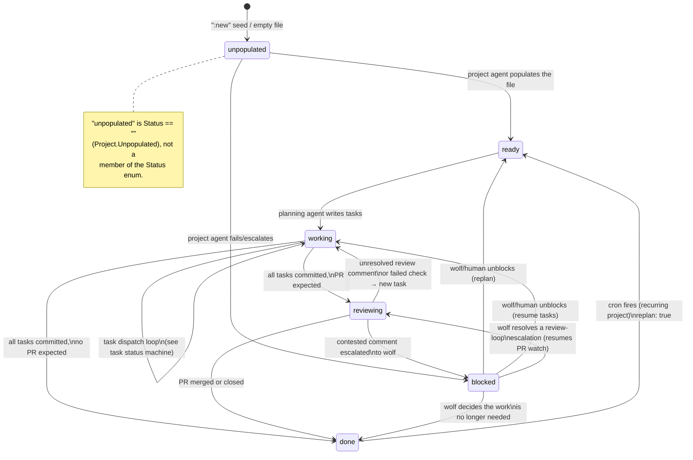
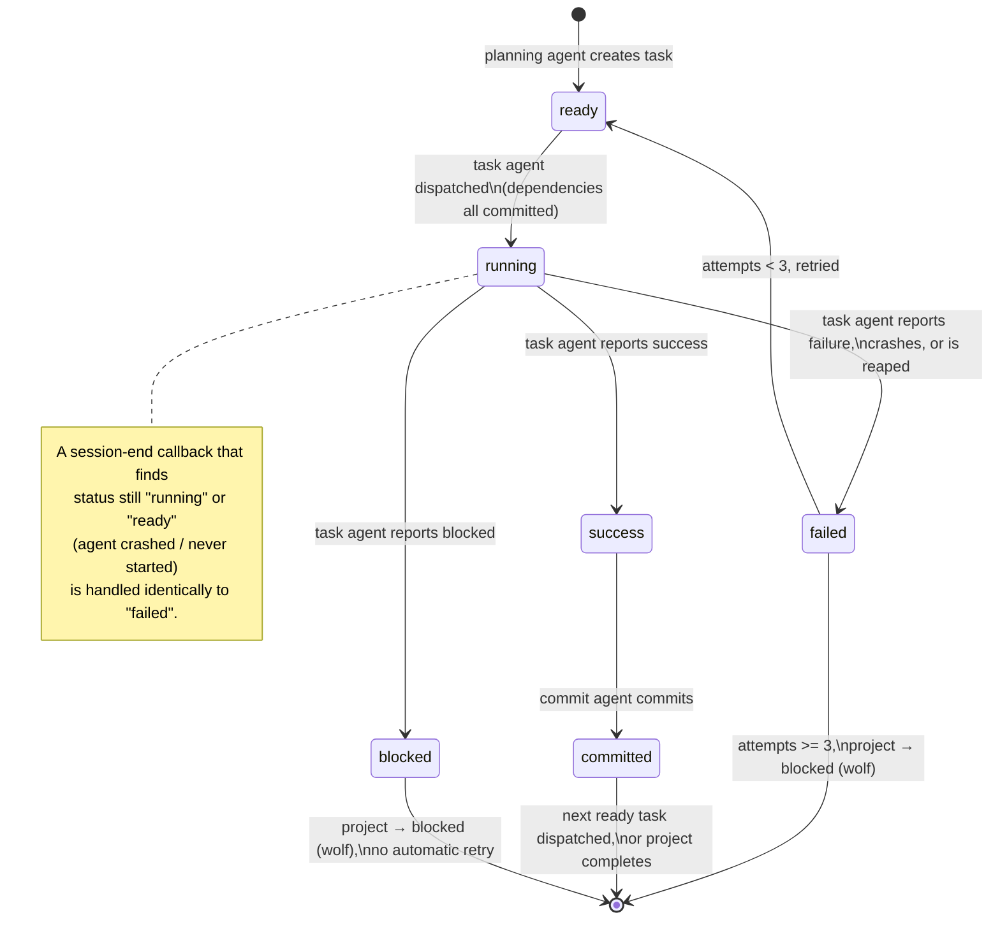

# The state machines

This document describes the two state machines the daemon (`internal/daemon`)
actually drives today: the **project status** machine and the **task status**
machine. `design.md` is the original spec and `README.md` is the user-facing
guide — both are useful background, but each has drifted from the
implementation in places (e.g. neither mentions the `reviewing` project
status or cron replan behavior described below). Every transition described
here is grounded in the current Go source; where design.md describes
something that isn't implemented, this doc says so explicitly instead of
carrying the discrepancy forward.

Source of truth for the enums:

- Project status — `internal/project/status.go`
- Task status — `internal/task/task.go`

Source of truth for the transition logic — `internal/daemon/dispatch.go`,
`dispatch_lifecycle.go`, `reconcile.go`, `watcher.go`, `review.go`, and
`reaper.go`.

## 1. Project status

### Diagram



`cleanup: true` (→ archive agent) is an orthogonal side-flow, not a status
transition — see [§3](#3-the-cleanup--archive-side-flow-orthogonal-to-status).

### The enum

`internal/project/status.go` defines: `ready`, `working`, `blocked`, `done`,
`reviewing`. There is also the "unpopulated" case: `Status("")`, which is
**not** one of the five valid enum values but is accepted by
`UnmarshalYAML` as a sentinel — `Project.Unpopulated()` reports `Status ==
""`. A `:new` seed (description only, no status) and a legacy empty file both
present this way.

### unpopulated → ready / blocked (project bootstrap)

`internal/daemon/dispatch.go: dispatchProject` checks `p.Unpopulated()` first
and launches the **project agent** (`launchProjectRootAgent`) when true. The
project agent's job is to turn a `:new` seed into a populated file (setting
`status: ready`) or, if the description isn't actionable, escalate straight to
`status: blocked`.

The session-end callback is `afterProjectSession`
(`internal/daemon/dispatch.go`), which is also this handoff's crash-loop
circuit breaker:

- File now populated (status set) → productive; the failure counter for this
  project is cleared and `dispatchProject` runs on the new state.
- Still unpopulated, the agent process itself failed to start/run
  (`waitErr != nil`) → an environment error retrying can't fix, so
  `transitionProjectBlocked` fires immediately, no retry consumed.
- Still unpopulated, clean exit but no progress → retried with backoff
  (`backoffPlanning`, shared with planning's retry step) up to
  `maxProjectRetries` (3), then blocked.

### ready → working (planning)

`dispatchProject`'s `switch p.Status` routes `StatusReady` to
`launchProjectRootAgent(..., agent.PlanningAgent, ...)`. The planning agent
writes `tasks/*.yaml` and is expected to flip the project to `status:
working` when done.

`afterPlanningSession` (`internal/daemon/dispatch.go`) is the mirror-image
circuit breaker of `afterProjectSession`, with the same three-way decision
table and its own counter, `maxPlanningRetries` (3), backed by
`backoffPlanning` (delay = `attempt * planningBackoffStep`, capped at
`planningBackoffMax`; `planningBackoffStep = 2s`, `planningBackoffMax = 30s`).
On success, `afterPlanningSession` also clears any pending `Replan` flag
(`clearReplan`) before dispatching — the run that just finished is what
satisfied the replan request.

### working → task dispatch loop → done or reviewing

`StatusWorking` routes to `dispatchNextTask`
(`internal/daemon/dispatch.go`), which loads the task graph
(`internal/taskgraph`) for the project and:

1. If `g.AllCommitted()` → `transitionProjectComplete` (see below).
2. Else if some task is stuck at `status:success` (task agent finished, no
   commit agent has run yet — the interrupted task→commit recovery case) →
   resume by launching the commit agent for it.
3. Else if `g.Ready()` is non-empty → dispatch the first ready task.
4. Else → log `no_ready_tasks` and wait (nothing dispatchable right now).

The full task-level loop that fills in step 2/3 is the subject of
[§2](#2-task-status). Once every task in the graph reaches `committed`,
`transitionProjectComplete` (`internal/daemon/review.go`) decides between
`done` and `reviewing`:

```go
recurring := p.Cron != "" && !p.CronExpired()
probe := p.HasRepos() && !recurring && !p.NoReview
if d.scheduler != nil && (p.Review || probe) {
    d.transitionProjectReviewing(projectPath, p)
    return
}
d.transitionProjectDone(projectPath, p)
```

So a project enters `reviewing` when it has a scheduler wired up **and**
either:

- `Review: true` was set explicitly (a human/agent said "this is PR-shaped"), or
- `probe` is true: the project has repos (`HasRepos()`), it is not a live
  recurring cron project, and `NoReview` isn't set.

Otherwise it goes straight to `done`. Three edge cases worth calling out,
because each is a deliberate carve-out, not an oversight:

- **Recurring cron projects skip the probe.** A live recurring cron project
  (`p.Cron != "" && !p.CronExpired()`) rests at `done` between firings and
  commits directly with no PR — if the probe ran anyway, every single cycle
  would spin up a review agent just to find no PR and bounce back to `done`
  (the comment in the source calls this the "EmailPromotionSummary
  oscillation"). Such a project only enters `reviewing` if it explicitly asks
  via `review: true`. An *expired* schedule is no longer "recurring" and gets
  the probe again, one-shot-style.
- **`no_review: true` is the one-shot analogue.** Some repo-backed work never
  opens a PR (workspace setup, read-only health checks, direct-to-branch
  commits). `HasRepos()` is only a *proxy* for "might have a PR", so
  `NoReview` lets such a project skip the probe and go straight to `done`.
  It only suppresses the *proxy* — an explicit `Review: true` still wins.
- **No scheduler, no reviewing.** The PR-resolution loop is poll-driven
  (`d.scheduler`), so a scheduler-less daemon (tests, or a deliberately
  simplified deployment) never enters `reviewing` and keeps the original
  terminal (`done`-only) behavior.

### reviewing → working / blocked / done (the PR-resolution loop)

`transitionProjectReviewing` (`internal/daemon/review.go`) writes
`status: reviewing` and calls `ensureReviewPoll`, which registers the
project's `#review` scheduler entry and kicks an immediate review-agent run.

The poll (`onReviewPoll`) uses a **change-detection gate** to avoid running
an expensive review agent on every tick: `reviewPRFingerprint` hashes each
watched PR's `headRefOid`, `updatedAt`, and `statusCheckRollup` (via `gh pr
view`, no sandbox needed). If the fingerprint is unchanged since the last
reconcile, the tick is "quiet" — the cadence steps to the next, slower rung
and the review agent is *not* launched. A changed (or not-yet-known)
fingerprint runs the agent and snaps the cadence back to the fastest rung.
The backoff ladder, `reviewPollSpecs`, is:

```
@every 2m → @every 5m → @every 15m → @every 30m (capped)
```

A `:review` command on an already-reviewing project sets `ReviewNow`, which
`forceReviewNow` uses to bypass the gate and dispatch immediately, resetting
the cadence.

`afterReviewSession` (`internal/daemon/review.go`) is where the loop's
outcome is decided — purely by reading what status the review agent left the
project in:

- **`reviewing` (unchanged)** → the PR is clean this cycle (or there's no PR
  yet with `review: true` still watching). The fix-cycle counter resets, a
  fresh fingerprint baseline is recorded, and polling continues.
- **`working`** → the review agent turned an unresolved review comment or a
  failed check into one or more new tasks. The poll is unregistered while
  those tasks run (`clearReviewPolling`; a fresh baseline is taken only once
  the project returns to `reviewing`), and a **fix-cycle counter**
  (`reviewFixCycles`) is bumped. If it exceeds `maxReviewFixCycles` (10)
  *consecutive* fix cycles that never converged back to a clean `reviewing`
  poll, the project is blocked instead ("PR review produced N consecutive fix
  cycles without converging; needs a human"). Otherwise `revisitProject`
  dispatches the new tasks per §2.
- **`blocked`** → the review agent escalated (e.g. a contested comment it
  can't resolve on its own). Polling stops and the project's new `blocked`
  status is routed normally (→ wolf).
- **`done`** → the PR was merged or closed. Polling stops, review state is
  cleared, and the project's `done` routing takes over.

A non-nil `waitErr` (the review agent's *process* failed — most commonly its
sandbox couldn't be created, e.g. a github MCP auth problem) is **not**
treated as a clean "nothing to do" tick: it would otherwise be
indistinguishable from an unchanged `reviewing` status. Consecutive crashes
are counted (`reviewErrors`) and once they reach `maxReviewErrors` (5) the
project is blocked with a diagnostic pointing at the likely cause.

While a project sits in `reviewing`, a human (or another agent) can still
queue manual tasks. `dispatchProject`'s `StatusReviewing` case calls
`dispatchPendingTasks` first — if there's pending task work it dispatches
that (using the project's single agent slot; the project stays `reviewing`)
and returns before touching the poll. Only when there's nothing pending does
it fall through to (re-)arming the `#review` poll.

### blocked → wolf → ready / working

`StatusBlocked` routes to `launchWolfAgent`
(`internal/daemon/dispatch_lifecycle.go`). The wolf runs as an **interactive**
agent (`internal/daemon/reaper.go: strandedVerdict` explicitly never reaps it
on an idle timeout — it may sit waiting on a human indefinitely) under its
own session key (`wolfSessionKey`, a `#wolf` suffix) so it can run in tandem
with whatever else the project's main slot is doing, and it dedups against
that key rather than the project's.

`launchWolfAgent` reads back a durable `blocked-session.yaml` record
(`project.BlockedSessionPath`, `internal/project/blocked_session.go`) if a
prior wolf invocation left one, and folds its `Summary`/`Attempted` fields
into the new session's context — so a repeat invocation of the same block (or
a fresh one) starts from what was already learned rather than re-deriving
context from scratch. The wolf itself decides how to resolve the block, and
the session-end callback simply `revisitProject`s — the daemon has no
wolf-specific routing; whatever status the wolf leaves on disk is dispatched
exactly like any other observation. Per its prompt
(`internal/prompts/templates/wolf.tmpl`), the wolf's exit status depends on
what kind of block it was resolving:

- A project blocked before it was ever populated (no tasks, empty
  `repos`/`branch`) → gather the missing details from the user, fill in the
  project fields, and set `status: ready` so planning can run.
- A review-loop escalation (contested comment, a check that won't converge,
  too many fix cycles, or a wedged review-agent sandbox) → almost always
  back to `status: reviewing`, **not** `working` or `done` — that resumes the
  PR watch and lets the review agent re-derive fix tasks itself, rather than
  the wolf hand-authoring them. `working` is only correct if the wolf
  deliberately wants to author and dispatch fix tasks itself; `done` only if
  the PR work is genuinely finished and no more watching is wanted.
- Any other block (e.g. a task's retries exhausted) → typically `ready` (fresh
  plan) or `working` (resume the task graph) after fixing whatever the
  individual task/project files needed.

Any project-root agent (project, planning, task, commit) that fails to
*launch* also routes here via `transitionProjectBlocked`, as does a
`taskgraph.Load` structural error (unknown dependency, cycle, duplicate
name — see §2) and a task's retry-budget exhaustion. `transitionProjectBlocked`
persists `blocked_reason`, notifies the user, unregisters the `#review` poll
if one was running, clears in-memory review state, and launches the wolf —
uniformly, regardless of which caller triggered the block.

### done and the cron-driven recurring cycle

`done` is terminal for the *automatic* cycle in the non-cron case, but two
things keep it from being a dead end:

- **Manual tasks after completion.** `dispatchProject`'s `StatusDone` case
  still calls `dispatchPendingTasks` — a human can append tasks to a finished
  project and they still run; a fully-committed graph is a no-op so a truly
  finished project stays `done` (this path never re-runs the completion
  transition, so it can't spuriously flip to `reviewing`).
- **Cron replan.** A project with a live `cron:` schedule treats `done` as its
  *resting* state between cycles, not a final state. See below.

Cron scheduling is registered per-project by `registerCronIfAny`
(`internal/daemon/dispatch.go`), called from `dispatchProject` before status
routing runs. Every cron schedule must declare a stop condition —
`cron_until` (an RFC3339 deadline) or `cron_max_runs` (a cycle count,
`project.CronMaxRuns`/`CronRuns`) — checked by `Project.CronUnbounded()`; a
schedule with neither is refused and the project is immediately blocked so a
human fixes the file (no default deadline is invented). A schedule whose stop
condition has already tripped (`CronStopReason()` non-empty) is not
registered (and any stale registration is dropped), so a daemon restart can't
revive an expired schedule.

The recurring cycle, driven by `onCronFired`
(`internal/daemon/dispatch.go`) on each firing:

1. **Entry check** — if the stop condition is already met on disk, unregister
   and stop; no work is attempted.
2. **`requestCronReplan`** decides whether this firing should start a new
   cycle. It only rewrites the project (`status: ready`, `replan: true`) when
   the project is **idle** — specifically `status == done` (the recurring
   case: last cycle finished, start the next) or `status == ready` (planning
   hasn't run yet, or is being retried; treat this firing as a re-plan
   request). Every other status is left alone on purpose:
   - `working` — tasks are running; rewriting the status mid-flight would
     re-plan the graph out from under live task agents. The firing falls
     through to the ordinary recovery poll instead.
   - `blocked` — needs a human/wolf; re-planning would silently paper over
     the failure and lose `blocked_reason`.
   - `cleanup: true` or `archive: true` — the project is being wound down;
     nothing to re-plan.
   A firing that starts no cycle logs `cron_run_not_counted` and still calls
   `revisitProject` (the poke is useful even without a full cycle) but is
   **not** charged against `cron_max_runs`.
3. **Count** — only a firing that *did* start a cycle (`requestCronReplan`
   returned `""`) is charged: `countCronRun` re-reads the file (to avoid
   clobbering the replan write just made) and increments/persists
   `cron_runs`.
4. **Exit check** — the stop condition is re-evaluated against the
   post-increment count; if it now trips, the schedule unregisters. This is
   why the Nth run still completes its cycle: the schedule stops *after* the
   Nth run, not instead of it.

`transitionProjectDone` (`internal/daemon/dispatch_lifecycle.go`) is the
counterpart that must NOT unregister a live recurring schedule: it only
unregisters cron when the project isn't recurring (`Cron == ""`) or the
schedule has expired (`CronExpired()`) — otherwise `done` would be a one-shot
dead end for every cron project. The `#review` poll, by contrast, is always
unregistered on `done` — the PR loop (if any) is finished regardless of cron.

## 2. Task status

### Diagram



### The enum

`internal/task/task.go` defines: `ready`, `running`, `success`, `failed`,
`blocked`, `committed`. Unlike project status there is no "unpopulated"
sentinel for tasks — a task file with a blank `name` and a non-blank
`description` is instead a **pending seed** (`internal/taskgraph/graph.go:
Load`), excluded from the graph entirely (not even loaded as a `Task`) until
the planning agent gives it a real name. `taskgraph.Graph.HasPendingSeed()`
exposes this so the daemon can re-arm planning for an orphaned seed sitting
on a resting (`done`/`reviewing`) project (`dispatchProject`'s pending-seed
re-arm check, `internal/daemon/dispatch.go`).

### ready → running (dispatch)

The **task graph** (`internal/taskgraph/graph.go`) is a pure snapshot of
`tasks/*.yaml`, computed fresh from disk every time the daemon needs it — it
is never cached across dispatch decisions. `Graph.Ready()` returns tasks
whose `status == ready` **and** every dependency (`depends_on`) is
`committed`; a task already running or finished is never re-included
regardless of its dependency state.

`dispatchReadyOrPending` (`internal/daemon/dispatch.go`) picks the first
`Ready()` task (deterministic name order) and hands it to
`dispatchReadyTask`, which special-cases **push tasks**
(`task.IsPushTask()`, `Source.Kind == "pr-push"`): a push task carries no code
work of its own — it exists only to publish the commit-only fix commits a
batch of review-agent tasks left in the worktree — so it is routed straight
to the **commit agent** in push mode, skipping the (work-less) task-agent
phase entirely. Every other ready task goes to `launchTaskAgent`, which
starts a task agent in a fresh (or existing, if `SaveSandbox` shared it)
workspace.

Structural graph errors — an unknown dependency, a dependency cycle, or a
genuine duplicate task name — are **not** repairable per-file and abort
`taskgraph.Load` entirely; `loadTaskGraph` (`internal/daemon/dispatch.go`)
responds by blocking the whole project for the wolf rather than silently
stranding it. A cosmetically-invalid name (blank, not kebab-case, or too
long), by contrast, *is* repaired in place (slugified, deduped) with a loud
`Warnings()` entry — one bad task file must not abort every other task in the
project.

### running → success / failed / blocked

`afterTaskSession` (`internal/daemon/dispatch_lifecycle.go`) is the single
place task-level transitions are decided, and it runs **only** on the task
agent's session-end callback — task files are deliberately not
fsnotify-watched for lifecycle purposes (`handleTask` only logs), to avoid a
race where an agent writes `status:success` and exits before the daemon's
session tracker observes the session ending.

- **`success`** → `launchCommitAgent` (see below).
- **`failed`, `running`, or `ready`** → `handleTaskFailure`. `running`/`ready`
  mean the agent's session ended without ever writing a terminal status (it
  crashed, or never started) — treated identically to an explicit `failed`.
- **`blocked`** → the agent decided it can't proceed. The task's sandbox is
  retained (`retainSandbox`, sets `save_sandbox: true`) so the wolf can
  inspect it, and the project is blocked immediately — **no retry** regardless
  of `Attempts`.
- **`committed`** → invariant violation (task agents must never commit
  directly) — the project is blocked to surface the bug rather than silently
  accepting it.

`internal/daemon/reaper.go` is the backstop that guarantees a session
actually reaches this callback even if the agent process wedges: a session
whose task has already reached a terminal-for-its-stage status
(`success`/`failed` for a task agent, `committed` for a commit agent) but
whose wrapper hasn't exited within `sessionDoneGrace` (90s) is force-closed
(`reapCauseStageComplete`); one that has produced no ACP stream activity for
longer than `sessionIdleTimeout` (default 20 minutes) is force-closed as a
mid-turn hang (`reapCauseIdleTimeout`). Either way, closing the session
unblocks the same `afterTaskSession`/`afterCommitSession` path a clean exit
would have taken.

### failed → ready (retry) or → blocked (exhausted)

`handleTaskFailure` (`internal/daemon/dispatch_lifecycle.go`) is a strict
attempt-budget check against `maxTaskAttempts` (3):

```go
if t.Attempts >= maxTaskAttempts {
    // retain sandbox, transitionProjectBlocked, return
}
// bump Attempts, status → ready, clear FailureReason, save, relaunch task agent
```

So a task's 1st, 2nd, and 3rd failures (`Attempts` 0→1, 1→2, 2→3) are retried
by resetting it to `ready` and relaunching a task agent; once `Attempts`
reaches 3 *before* this failure is even processed (i.e. this would be the
4th attempt), retries are exhausted, the sandbox is retained for inspection,
and the whole project blocks — a single task's terminal failure blocks
everything else in the graph too, since nothing downstream of it can ever
have its dependency satisfied.

### success → committed (commit agent) → next task or project completion

`launchCommitAgent` (`internal/daemon/dispatch_lifecycle.go`) runs the commit
agent in the same workspace shape as the task agent (it needs the repos
checked out to `git commit`/`git push` in them). `afterCommitSession` is its
session-end callback:

- If the task did **not** end in `status: committed`, that's a hard failure —
  block the project for the wolf (mirrors the task-agent side's "must reach a
  specific terminal status or it's an invariant violation" pattern).
- Otherwise it stamps `CompletedAt` (once, the first time committed is
  observed — the daemon writes this *after* the commit agent's session ends,
  so an agent rewriting the task file mid-run can never clobber it) and
  reloads the task graph:
  - `AllCommitted()` → `transitionProjectComplete` (§1: done or reviewing).
  - Else if another task is stuck at `success` (interrupted commit handoff)
    → resume its commit agent.
  - Else if `Ready()` is non-empty → dispatch the next ready task
    (`dispatchReadyTask`, same push-task special-case as above).
  - Else → nothing ready but not all committed → block ("no ready tasks
    remain but project is not fully committed"); this is a stuck-graph
    invariant violation (e.g. every remaining task is `failed`/`blocked` with
    no path forward).

Only a **push task** (`Source.Kind == "pr-push"`) actually publishes to the
remote — `launchCommitAgent` sets `PushBranch: t.IsPushTask()` on its plan, so
an ordinary task's commit stays local. This is why individual review-fix
commits accumulate locally until a review-agent-inserted push task
(depending on that batch) publishes them together, rather than the PR seeing
a stream of individual commits. Regular (non-review) work is instead
published by the **archive agent** at cleanup time (§3), not by any commit
agent.

## 3. The cleanup / archive side-flow (orthogonal to status)

`cleanup: true` and `archive: true`/`false` are independent boolean flags on
`.project.yaml`, **not** part of the status enum — a project keeps whatever
status it had (working, blocked, done, reviewing) while a cleanup runs
(`internal/project/project.go`, `Project.Cleanup`/`Archive` doc comments).
`dispatchProject` (`internal/daemon/dispatch.go`) checks `p.Cleanup` **ahead
of** status routing (right after the cron registration check, before the
`switch p.Status`), so `:cleanup` works on a project in any status — and
short-circuits: the normal status agent must not run at the same time the
archive agent is trying to leave the very same workspace clean and pushed.

The contract, end to end:

1. The TUI's `:cleanup` sets `Cleanup = true` and saves as `WriterAgent` (a
   daemon-authored write is dropped by the daemon's own fsnotify filter and
   would never be observed).
2. `launchArchiveAgent` reserves a cleanup-in-flight guard
   (`beginCleanup`/`endCleanup`, keyed by project path) spanning from launch
   until the request flag is cleared — deliberately wider than the session's
   own lifetime, because a `.project.yaml` event from the agent's own
   `archive: true` write can arrive in the gap between the session ending and
   the flag being cleared; without the wider guard that late event would
   dispatch a second archive agent. The archive agent runs under its own
   session key (`archiveSessionKey`, an `#archive` suffix) so it doesn't
   contend with the project's shared agent slot.
3. `afterArchiveSession` clears `cleanup: true` (written as the daemon, so
   the clear can't retrigger dispatch) regardless of whether the agent
   succeeded — an agent that gave up should not be relaunched by the next
   unrelated file event; a human re-issues `:cleanup` to retry. Only after
   the clear lands does it call `revisitProject` to resume normal routing;
   if the clear fails to persist, the revisit is skipped so a second archive
   agent isn't dispatched against a request the file still shows as pending.

Whether the archive agent actually needs to push is decided per-repo by a
**two-step upstream-then-count check**, specified in its prompt template
(`internal/prompts/templates/archive.tmpl`) rather than in Go: first
`git rev-parse --abbrev-ref --symbolic-full-name @{upstream}` settles whether
an upstream exists at all (a non-zero exit / empty result means "never
published, needs pushing"), and only if that succeeds does
`git rev-list --count @{upstream}..HEAD` count how far ahead of it the branch
is. The two steps are not interchangeable: `rev-list --count @{upstream}..HEAD`
also exits non-zero/empty when there's no upstream configured, so reading an
empty `ahead` on its own would be ambiguous between "up to date" and "no
upstream yet" — the template explicitly forbids treating a missing `ahead` as
license to push, and requires the upstream question to be settled first, by
`rev-parse` alone. The archive agent sets `archive: true` only once every
repo in the workspace is clean (nothing to commit, and either nothing to push
or the push succeeded); if it can't finish (a rejected push, an unapproved
`.gitignore` change, unclassifiable working-tree state) it leaves `archive`
unset and reports what's outstanding rather than marking the project falsely
clean.

Cron's own idle-check (`requestCronReplan`, §1) treats `Cleanup` and
`Archive` as non-idle for the same reason `dispatchProject` gives cleanup
priority over status routing: a project being wound down has nothing left to
re-plan, and a planning run mid-cleanup would dirty the workspace the archive
agent is trying to leave clean.
